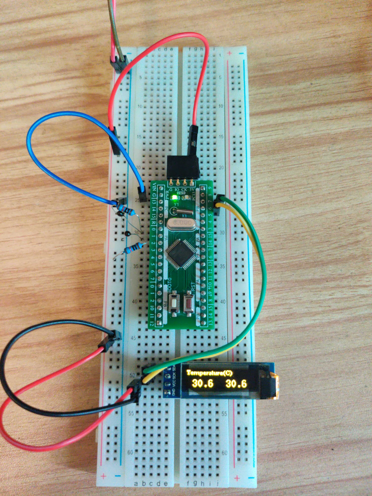

<!-- 

  

 -->

<h3 align="center">TMCC</h3>

---

 🤖 Temperature Monitor and Cooling Controller
      

## 📝 Table of Contents

- [📝 Table of Contents](#-table-of-contents)
- [🧐 About ](#-about-)
- [🎥 Demo / Working ](#-demo--working-)
- [🏁 Current state ](#-current-state-)
- [⛏️ Built Using ](#️-built-using-)
- [✍️ Authors ](#️-authors-)
- [🎉 Acknowledgements ](#-acknowledgements-)

## 🧐 About 

This desigh applys temperature monitoring and contolling on both cool side and hot side of TEC water cooling system.

When water cooling the CPU, GPU, south bridge, it might be an efficient way to cool the water using TEC (thermo-electric cooler or Peltier element) to exchange heat to the fans. but TEC is easy to **burn** if the temperature of the hot side rise to high. That is why it need both side monitorring。

## 🎥 Demo / Working 

## 🏁 Current state 

Legend:

✔️ = working
❌ = not working at all
⚠️ = some features not working
⁉️ = untested
⛏️ = WIP

| Name                    | Works? | Notes                             |
| ----------------------- | ------ | --------------------------------- |
| ntc sensor              | ✔️      | Tested on NTC 10K 3950            |
| display                 | ✔️      | Tested on SSD1306 I2C 128x32 OLED |
| temperature controlling | ⛏️      |                                   |

## ⛏️ Built Using 

- [ArduinoCore-GD32](https://github.com/CommunityGD32Cores/ArduinoCore-GD32) - GD32 arduino framework
- [platform-gd32](https://github.com/CommunityGD32Cores/platform-gd32) - PlatformIO platform for ARM-based GD32{F,E,L,W} chips. 
- [platformio](https://github.com/platformio/platformio-vscode-ide) - PlatformIO IDE for VSCode: The next generation integrated development environment for IoT
- [easyeda or lceda](https://easyeda.com/) - An Easier and Powerful
Online PCB Design Tool

## ✍️ Authors 

- [@arcayi](https://github.com/arcayi) - Idea & Initial work

See also the list of [contributors](https://github.com/arcayi/ntc_ssd1306.gd32-arduino/contributors) who participated in this project.

## 🎉 Acknowledgements 

